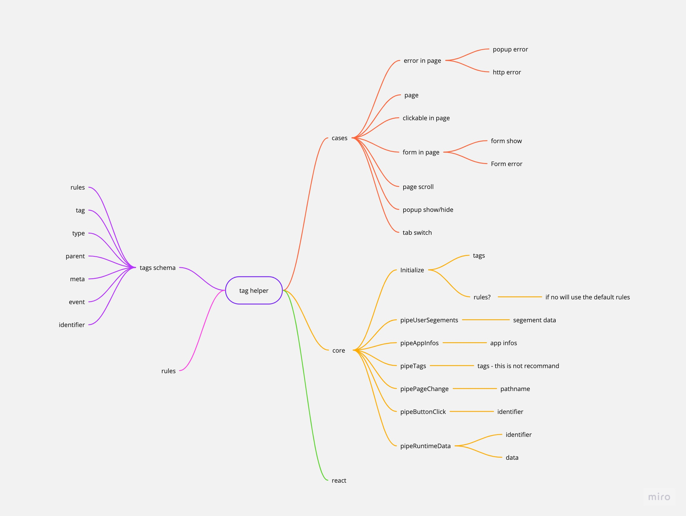

This is a tools for helping FE developers adding tags to track user journey.

# Plan

-
# TODO
- [x] Add storybook covert button and mdx description(mdx as documentations in storybook)
- [x] Add unit testing coverage > 80%
- [x] Add eslint, commit lint, semantic release
- [x] Add github action[eslint, test, build, release, chromatic]
- [x] storybook as part of testing - must cover full cases
- [x] Add readme as documentations

